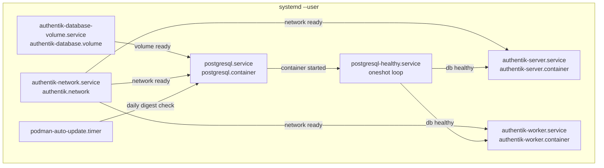

# Design Document

## Feature: podman-quadlet-authentik

---

## Overview

This design describes the migration of an existing Docker Compose–based Authentik identity provider stack to rootless Podman Quadlet systemd unit files. The result is a set of declarative Quadlet files that `podman-system-generator` converts into native systemd services, giving the stack proper dependency ordering, automatic restart, and daily image auto-update — all without root privileges.

The stack consists of five Quadlet unit files and one hand-written systemd service:

| File | Type | Purpose |
|---|---|---|
| `authentik-database.volume` | `.volume` | Declares the named volume for PostgreSQL data |
| `authentik.network` | `.network` | Declares the private bridge network shared by all containers |
| `postgresql.container` | `.container` | PostgreSQL 16-alpine database |
| `authentik-server.container` | `.container` | Authentik server process |
| `authentik-worker.container` | `.container` | Authentik worker process |
| `postgresql-healthy.service` | `.service` | Oneshot health-gate that blocks server/worker until PostgreSQL is ready |

All files are placed under `~/.config/containers/systemd/` and managed via `systemctl --user`.

### Key Design Decisions

**Health-gate via oneshot service**: Quadlet's `After=postgresql.service` only waits for the container to start, not for PostgreSQL to be ready to accept connections. A hand-written `postgresql-healthy.service` (Type=oneshot) polls `podman healthcheck run postgresql` in a loop and exits zero only when the database is healthy. The server and worker depend on this gate service rather than directly on `postgresql.service`.

**Named volume via `.volume` Quadlet**: Using `authentik-database.volume` lets Podman manage the volume lifecycle independently of the container. The volume is referenced in `postgresql.container` as `authentik-database.volume:/var/lib/postgresql/data`, which Quadlet translates to the `systemd-authentik-database` named volume and automatically adds a `Requires=`/`After=` dependency on `authentik-database-volume.service`.

**Private network via `.network` Quadlet**: A dedicated `authentik.network` file creates a `systemd-authentik` bridge network. All three containers join it, enabling DNS-based hostname resolution (`postgresql`, `authentik-server`, `authentik-worker`) without exposing the database port on the host.

**No `User=root`**: The original Compose setup ran the worker as `user: root` to access the Docker socket. The Quadlet design removes the Docker socket mount entirely (Authentik's worker does not require it in rootless Podman deployments) and runs all containers under the user's UID.

**Controlled Authentik updates via manual pull**: Authentik occasionally ships breaking changes within a minor series. Rather than using `AutoUpdate=registry` on the Authentik containers (which would apply updates unattended), the server and worker use the floating `2026.2` tag but omit `AutoUpdate=registry`. Because `podman auto-update` only surfaces containers that carry the label, it will not report or touch the Authentik containers at all. When an update is desired, the operator runs `podman pull ghcr.io/goauthentik/server:2026.2`, reviews the changelog, then restarts the services. PostgreSQL uses `AutoUpdate=registry` and the built-in daily timer because its patch releases within `16-alpine` are low-risk.

---

## Architecture



**Startup sequence:**

1. `authentik-database-volume.service` and `authentik-network.service` run as oneshot services, creating the volume and network if they do not already exist.
2. `postgresql.service` starts the PostgreSQL container (depends on both).
3. `postgresql-healthy.service` polls `podman healthcheck run postgresql` until the database accepts connections, then exits 0.
4. `authentik-server.service` and `authentik-worker.service` start in parallel once the health gate passes.

---

## Components and Interfaces

### `authentik-database.volume`

Declares the named Podman volume for PostgreSQL persistent data. Quadlet generates `authentik-database-volume.service` (Type=oneshot) that runs `podman volume create` if the volume does not exist.

```ini
[Volume]
# No extra options needed; default local driver is sufficient.
```

The generated volume name is `systemd-authentik-database`.

### `authentik.network`

Declares the private bridge network. Quadlet generates `authentik-network.service` (Type=oneshot).

```ini
[Network]
# Default bridge driver with DNS enabled (Podman default).
# NetworkName is implicitly systemd-authentik.
```

All three containers reference this network as `authentik.network` in their `Network=` directive, which Quadlet resolves to `systemd-authentik` and adds the appropriate service dependency.

### `postgresql.container`

Runs `docker.io/library/postgres:16-alpine`. Key directives:

- `ContainerName=postgresql` — sets the container name to `postgresql` (without the `systemd-` prefix) so that other containers can reach it by hostname and so that `podman healthcheck run postgresql` works by name.
- `Network=authentik.network` — joins the private network.
- `Volume=authentik-database.volume:/var/lib/postgresql/data` — mounts the named volume.
- `EnvironmentFile=` pointing to the `.env` file.
- `Environment=` for `POSTGRES_DB`, `POSTGRES_PASSWORD`, `POSTGRES_USER`.
- `HealthCmd`, `HealthInterval`, `HealthTimeout`, `HealthStartPeriod`, `HealthRetries` — configures the built-in healthcheck.
- `AutoUpdate=registry` — enables digest-based auto-update.
- `Restart=always` in `[Service]`.
- No `PublishPort=` — the database is not exposed on the host.

### `postgresql-healthy.service`

A hand-written systemd oneshot service (not a Quadlet file) that acts as a health gate. It is placed alongside the Quadlet files in `~/.config/containers/systemd/` but uses a plain `.service` extension so the generator ignores it.

```ini
[Unit]
Description=Wait for PostgreSQL container to be healthy
After=postgresql.service
Requires=postgresql.service

[Service]
Type=oneshot
RemainAfterExit=yes
ExecStart=/bin/sh -c 'until podman healthcheck run postgresql; do sleep 2; done'
TimeoutStartSec=180
```

`RemainAfterExit=yes` keeps the unit in the `active` state after the oneshot exits, so that `authentik-server.service` and `authentik-worker.service` (which declare `Requires=postgresql-healthy.service`) are not torn down when the oneshot completes.

`TimeoutStartSec=180` gives 180 seconds of headroom — comfortably above the ~170s worst case (5 retries × 30s interval + 20s start period) calculated from the PostgreSQL healthcheck parameters. If the database has not become healthy within that window, systemd will fail the unit cleanly and the server and worker will not start.

### `authentik-server.container`

Runs `ghcr.io/goauthentik/server:2026.2` with `Exec=server`. Key directives:

- `Network=authentik.network`
- `PublishPort=127.0.0.1:9000:9000` — binds only to localhost, no HTTPS port.
- `Volume=%h/authentik/data:/data` and `Volume=%h/authentik/custom-templates:/templates`
- `EnvironmentFile=` and five `Environment=` directives.
- `ShmSize=512m`
- No `AutoUpdate=registry` — Authentik updates are applied manually after changelog review.
- `Restart=always` in `[Service]`.
- `[Unit]` section: `After=postgresql-healthy.service` and `Requires=postgresql-healthy.service`.

### `authentik-worker.container`

Runs `ghcr.io/goauthentik/server:2026.2` with `Exec=worker`. Key directives:

- `Network=authentik.network`
- Three bind mounts: `%h/authentik/data:/data`, `%h/authentik/certs:/certs`, `%h/authentik/custom-templates:/templates`
- `EnvironmentFile=` and five `Environment=` directives.
- `ShmSize=512m`
- No `AutoUpdate=registry` — Authentik updates are applied manually after changelog review.
- `Restart=always` in `[Service]`.
- `[Unit]` section: `After=postgresql-healthy.service` and `Requires=postgresql-healthy.service`.
- No socket mount — the Docker socket mount from the original Compose setup is intentionally omitted for rootless operation.

### Auto-Update

PostgreSQL uses `AutoUpdate=registry` with the built-in `podman-auto-update.timer`:

```
systemctl --user enable --now podman-auto-update.timer
```

This triggers `podman-auto-update.service` daily. Only `postgresql.container` carries `AutoUpdate=registry`, so only the PostgreSQL image is checked and restarted automatically.

For Authentik server and worker, updates are operator-controlled. Because these containers do not carry `AutoUpdate=registry`, `podman auto-update` will not report or touch them at all — even in dry-run mode. The manual update flow is:

```bash
# 1. Pull the latest digest for the floating tag
podman pull ghcr.io/goauthentik/server:2026.2

# 2. Review https://goauthentik.io/docs/releases/2026.2

# 3. Restart the containers to pick up the new image
systemctl --user restart authentik-server.service authentik-worker.service
```

---

## Data Models

### Environment File (`.env`)

The `.env` file is co-located with the Quadlet units at `~/.config/containers/systemd/.env` (or an absolute path referenced by `EnvironmentFile=`). It supplies all secrets and configuration values.

```
# PostgreSQL
PG_DB=authentik
PG_USER=authentik
PG_PASS=<required — no default>

# Authentik
AUTHENTIK_SECRET_KEY=<required — no default>
```

The container units translate these to the expected environment variable names via `Environment=` directives:

| `.env` key | Container env var | Used by |
|---|---|---|
| `PG_DB` | `POSTGRES_DB` | postgresql |
| `PG_USER` | `POSTGRES_USER` | postgresql |
| `PG_PASS` | `POSTGRES_PASSWORD` | postgresql |
| `PG_DB` | `AUTHENTIK_POSTGRESQL__NAME` | server, worker |
| `PG_USER` | `AUTHENTIK_POSTGRESQL__USER` | server, worker |
| `PG_PASS` | `AUTHENTIK_POSTGRESQL__PASSWORD` | server, worker |
| — | `AUTHENTIK_POSTGRESQL__HOST=postgresql` | server, worker (literal) |
| `AUTHENTIK_SECRET_KEY` | `AUTHENTIK_SECRET_KEY` | server, worker |

### Bind-Mount Paths

All bind mounts use the `%h` systemd specifier (expands to the user's home directory at runtime):

| Host path | Container path | Container |
|---|---|---|
| `%h/authentik/data` | `/data` | server, worker |
| `%h/authentik/custom-templates` | `/templates` | server, worker |
| `%h/authentik/certs` | `/certs` | worker only |

These directories must exist before the containers start. Operators should create them with `mkdir -p ~/authentik/{data,certs,custom-templates}`.

### Named Volume

| Quadlet name | Podman volume name | Mount point |
|---|---|---|
| `authentik-database.volume` | `systemd-authentik-database` | `/var/lib/postgresql/data` (in postgresql container) |

### Network

| Quadlet name | Podman network name | Driver |
|---|---|---|
| `authentik.network` | `systemd-authentik` | bridge (default) |

---

## Correctness Properties

*A property is a characteristic or behavior that should hold true across all valid executions of a system — essentially, a formal statement about what the system should do. Properties serve as the bridge between human-readable specifications and machine-verifiable correctness guarantees.*

The Quadlet unit files are declarative configuration files. Their correctness is expressed as invariants over file content: every container unit in the stack must satisfy certain structural properties. These properties are well-suited to parameterized testing — a test can iterate over the set of container files and assert that each one satisfies the invariant, catching any file that was accidentally misconfigured.

### Property 1: No container runs as root

*For any* `.container` unit file in the Authentik stack (`postgresql.container`, `authentik-server.container`, `authentik-worker.container`), the file content SHALL NOT contain a `User=root` directive.

**Validates: Requirements 2.2, 2.3, 2.4**

### Property 2: Every container loads an environment file

*For any* `.container` unit file in the Authentik stack, the file SHALL contain an `EnvironmentFile=` directive.

**Validates: Requirements 4.1, 4.2, 4.3**

### Property 3: PostgreSQL container is configured for auto-update; Authentik containers are not

THE `postgresql.container` file SHALL contain `AutoUpdate=registry`. THE `authentik-server.container` and `authentik-worker.container` files SHALL NOT contain `AutoUpdate=registry`.

**Validates: Requirements 9.1, 10.2, 10.3**

### Property 4: Every container restarts automatically

*For any* `.container` unit file in the Authentik stack, the `[Service]` section SHALL contain `Restart=always`.

**Validates: Requirements 8.1, 8.2, 8.3**

### Property 5: Authentik application containers have sufficient shared memory

*For any* Authentik application container unit file (`authentik-server.container`, `authentik-worker.container`), the file SHALL contain `ShmSize=512m`.

**Validates: Requirements 7.1, 7.2**

### Property 6: Authentik application containers declare all required environment variables

*For any* Authentik application container unit file (`authentik-server.container`, `authentik-worker.container`), the file SHALL declare all five required environment variables: `AUTHENTIK_POSTGRESQL__HOST`, `AUTHENTIK_POSTGRESQL__NAME`, `AUTHENTIK_POSTGRESQL__PASSWORD`, `AUTHENTIK_POSTGRESQL__USER`, and `AUTHENTIK_SECRET_KEY`.

**Validates: Requirements 4.5, 4.6**

### Property 7: Worker container declares all required bind mounts

*For* the `authentik-worker.container` unit file, the file SHALL contain `Volume=` directives for all three required paths: `%h/authentik/data:/data`, `%h/authentik/certs:/certs`, and `%h/authentik/custom-templates:/templates`.

**Validates: Requirements 5.4, 5.5, 5.6**

---

## Error Handling

### Missing Environment File

If the `.env` file is absent at service start time, systemd will fail to activate the unit because `EnvironmentFile=` with a non-prefixed path causes an activation error when the file does not exist. The error appears in `journalctl --user -u authentik-server.service` as a descriptive message. Operators should ensure the file exists before enabling the stack.

To make the failure explicit rather than silent, the `EnvironmentFile=` path should **not** be prefixed with `-` (which would suppress the error). This is intentional per Requirement 4.7.

### PostgreSQL Startup Failure

If PostgreSQL fails to become healthy within 180 seconds, `postgresql-healthy.service` will fail with a timeout and systemd will report a clean activation error. The server and worker will not start because their `Requires=postgresql-healthy.service` is not satisfied.

If `postgresql.service` itself fails to start (e.g., bad image, volume permission error), `postgresql-healthy.service` will fail immediately because its `Requires=postgresql.service` is not satisfied, and the server and worker will not start.

### Auto-Update Pull Failure

If `podman auto-update` cannot pull a new image (network error, registry unavailable), it leaves the running container on the previously pulled image and exits non-zero. The `podman-auto-update.service` unit will report a failure in the journal, but the running containers are unaffected. This satisfies Requirement 10.6.

### Container Exit

All containers set `Restart=always`. A container that exits with any exit code (including 0) will be restarted by systemd. The restart delay follows systemd's default backoff policy.

---

## Testing Strategy

### Unit Tests (Static File Validation)

Static analysis of the generated Quadlet files verifies structural correctness without requiring a running Podman or systemd instance. These tests parse each unit file and assert the presence or absence of specific directives.

Recommended approach: use a shell-based test framework (e.g., `bats`) or a simple Python/Go test that reads the INI-format unit files.

**Example-based tests** (one assertion per specific file/directive):
- `postgresql.container` contains `Image=docker.io/library/postgres:16-alpine`
- `postgresql.container` contains `ContainerName=postgresql`
- `postgresql.container` contains `HealthCmd=pg_isready -d $POSTGRES_DB -U $POSTGRES_USER`
- `postgresql.container` contains `HealthInterval=30s`, `HealthTimeout=5s`, `HealthStartPeriod=20s`, `HealthRetries=5`
- `postgresql.container` does not contain `PublishPort=`
- `postgresql.container` contains `Volume=authentik-database.volume:/var/lib/postgresql/data`
- `authentik-server.container` contains `PublishPort=127.0.0.1:9000:9000` (literal, no variable substitution)
- `authentik-server.container` contains `Exec=server`
- `authentik-worker.container` contains `Exec=worker`
- `authentik-server.container` and `authentik-worker.container` both contain `Image=ghcr.io/goauthentik/server:2026.2`
- `authentik-server.container` and `authentik-worker.container` both contain `After=postgresql-healthy.service` and `Requires=postgresql-healthy.service`
- `postgresql.container` contains `AutoUpdate=registry`
- `authentik-server.container` does NOT contain `AutoUpdate=registry`
- `authentik-worker.container` does NOT contain `AutoUpdate=registry`
- `authentik-database.volume` exists and contains a `[Volume]` section
- `authentik.network` exists and contains a `[Network]` section
- `postgresql-healthy.service` contains `Type=oneshot` and `RemainAfterExit=yes`
- `postgresql-healthy.service` contains `TimeoutStartSec=180`

**Property-based tests** (parameterized over the set of container files):

Each property test iterates over the relevant set of container files and asserts the invariant holds for each. A property test framework is not strictly required — a simple loop in a test script achieves the same effect. If using a property-based testing library (e.g., `hypothesis` for Python, `fast-check` for TypeScript), generate the set of container file paths as the input space.

- **Property 1**: For each file in `{postgresql.container, authentik-server.container, authentik-worker.container}`, assert `User=root` is absent.
- **Property 2**: For each file in the same set, assert `EnvironmentFile=` is present.
- **Property 3**: Assert `postgresql.container` contains `AutoUpdate=registry`; assert `authentik-server.container` and `authentik-worker.container` do NOT contain `AutoUpdate=registry`.
- **Property 4**: For each file in the same set, assert `Restart=always` is present in the `[Service]` section.
- **Property 5**: For each file in `{authentik-server.container, authentik-worker.container}`, assert `ShmSize=512m` is present.
- **Property 6**: For each file in `{authentik-server.container, authentik-worker.container}`, assert all five required `Environment=` or `EnvironmentFile=`-sourced variable names are declared.
- **Property 7**: For `authentik-worker.container`, assert all three `Volume=` bind mount paths are present.

### Smoke Tests (Generator Validation)

Run the Podman Quadlet generator in dry-run mode to verify the files parse without errors:

```bash
/usr/lib/systemd/system-generators/podman-system-generator --user --dry-run
```

This catches syntax errors and unsupported directives without starting any containers.

### Integration Tests

These require a running rootless Podman and systemd user session:

1. **Dependency chain**: Start only `postgresql.service` and verify `authentik-server.service` and `authentik-worker.service` remain inactive until `postgresql-healthy.service` exits successfully.
2. **Missing env file**: Remove `.env`, attempt `systemctl --user start authentik-server.service`, verify the unit fails with a descriptive error.
3. **Restart on failure**: Kill the PostgreSQL container process, verify systemd restarts it automatically.
4. **Auto-update dry run**: Run `podman auto-update --dry-run` and verify it reports only `postgresql` as a candidate. Verify `authentik-server` and `authentik-worker` do not appear (they have no `AutoUpdate=registry` label).
